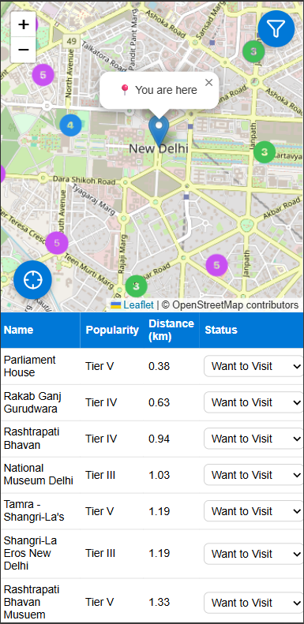

# 🌍 PtV — Places to Visit

**PtV (Places to Visit)** is a Progressive Web GIS Application (PWA) designed to help users explore, track, and plan their travel experiences across India and beyond.  
It features location-based filtering, personalized status tracking, offline usability, and integration with Google Maps for navigation — all within a lightweight, installable app.

🔗 **Live Demo:** [https://aadilsalmani.github.io/PtV](https://aadilsalmani.github.io/PtV)  
💻 **Source Code:** [https://github.com/aadilsalmani/PtV](https://github.com/aadilsalmani/PtV)

---

## ✨ Features

- 🗺️ **Interactive Map:** Explore locations powered by **Leaflet.js** & OpenStreetMap.  
- 📍 **Locate Me Button:** Centers map to your current GPS position.  
- 🎨 **Custom Marker Colors:** Unique icons for each popularity tier (Priority → Tier V).  
- 💾 **Persistent Filters:** Distance, popularity, and visit status saved in local storage.  
- 📱 **Progressive Web App (PWA):** Works offline, installable on mobile & desktop.  
- 🧭 **Google Maps Directions:** Get one-tap navigation from within the popup.  
- 📝 **Feedback Form:** Sends feedback directly to Google Sheets via Apps Script.  
- 🚦 **Status Management:** Tag each place — “Want to Visit,” “Visited,” “Visiting Later,” etc.  
- 🔔 **Smart Update Toast:** Prompts when a new version is available.  

---

## 🧠 Tech Stack

| Layer | Technology |
|-------|-------------|
| **Frontend** | HTML5, CSS3, Vanilla JavaScript |
| **Mapping** | Leaflet.js + OpenStreetMap |
| **Storage** | LocalStorage (for filters & statuses) |
| **Offline Caching** | Service Worker API |
| **Feedback Backend** | Google Apps Script + Google Sheets |
| **Hosting** | GitHub Pages (PWA enabled) |

---

## 📂 Project Structure

PtV/
├── css/
│ └── style.min.css
├── js/
│ └── script.min.js
├── data/
│ └── tourist_data.json
├── icons/
│ ├── icon-192.png
│ ├── icon-512.png
│ ├── red-marker.png … purple-marker.png
├── manifest.json
├── service-worker.js
└── index.html

---

## 🚀 How to Use

1. Open the [Live Demo](https://aadilsalmani.github.io/PtV).  
2. Allow **location access** when prompted.  
3. Apply filters — Popularity Tier, Distance, and Status.  
4. Tap any marker or table row to view details.  
5. Click **🧭 Get Directions** to open Google Maps navigation.  
6. (Optional) Install the app to home screen for offline use.

---

## 📲 Installation as PWA

- **Mobile:** Chrome → Menu → “Add to Home Screen”.  
- **Desktop:** Click the install icon 🡪 launch as stand-alone app.  
- Offline caching and local data persistence are automatic.

---

## 💬 Feedback System

All user feedback is submitted via an embedded **Google Apps Script** endpoint,  
which automatically logs data to a connected **Google Sheet** for analysis.

---

## 🔮 Future Enhancements

- 📊 Analytics Dashboard (show user statistics & travel patterns)  
- 🧠 AI-based recommendations for next destinations  
- 🗺️ Firebase user profiles & real-time status sync  
- 📡 Continuous GPS tracking via `watchPosition()`  
- 🌦️ Integration with weather & crowd data APIs  

---

## 👨‍💻 Developer

**Aadil Salmani**  
📍 Dwarka, Delhi, India  
💼 GIS Developer & Business Analyst  

🔗 [LinkedIn](https://www.linkedin.com/in/aadil-salmani) | [Portfolio](#)

---

## 🪪 License

This project is licensed under the **MIT License** —  
feel free to fork, modify, and contribute.

---

> _“Technology reveals the world — geography gives it meaning.”_  
> — Aadil Salmani

